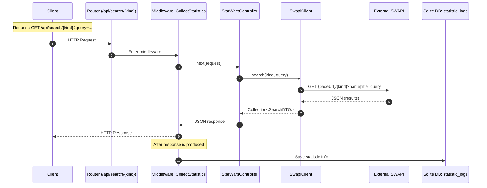
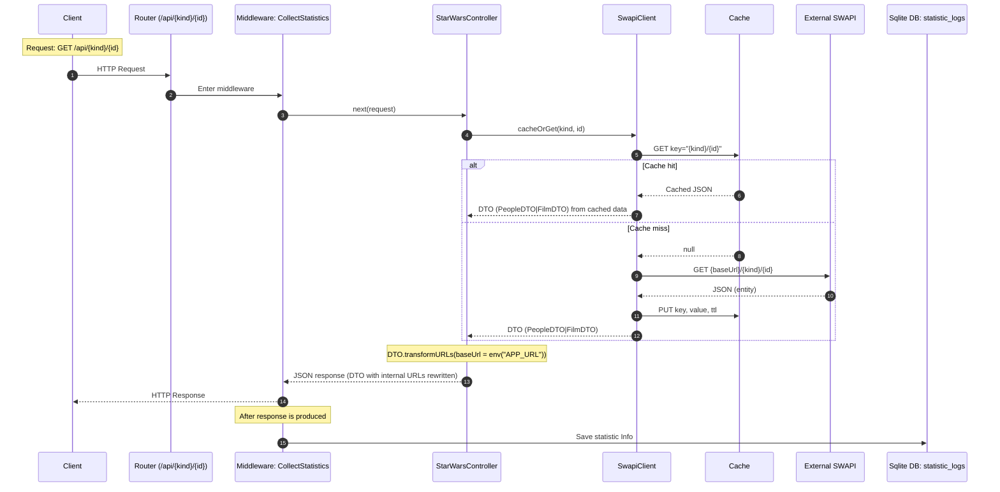

## Sequence Diagrams

- Routes (API):
  - `GET /api/search/{kind}?query=...` → `StarWarsController@search` (name: `search`) via `CollectStatistics`
  - `GET /api/{kind}/{id}` → `StarWarsController@getById` (name: `getById`) via `CollectStatistics`

### GET /api/search/{kind}?query=...

### GET /api/{kind}/{id}

